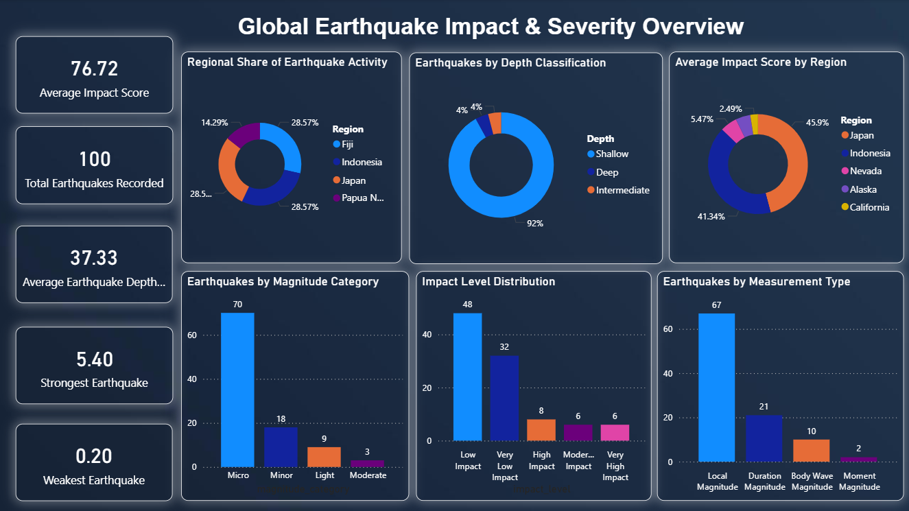

# USGS Earthquake ETL Pipeline


A simple, reproducible ETL project that ingests real‑time earthquake data from the
USGS FDSN web service, cleans and enriches it, validates quality, and loads the results
into PostgreSQL or flat files. Ideal for analysts who want a ready‑made dataset for
dashboards or machine‑learning experiments.

## 📊 Power BI Dashboard

Interactive dashboard built on PostgreSQL data, highlighting earthquake distribution, magnitude trends, impact levels, and regional activity insights.



## 🚀 Features

- **Extract** from USGS API with flexible time/magnitude filters
- **Transform** raw GeoJSON to tidy `pandas` DataFrame
- **Validate** data quality with automated checks and error logging
- **Load** into Postgres with upsert/partition logic or export CSV
- **Notebook** illustrates development steps & exploratory queries
- **Configurable** via `.env` or environment variables for local/dev

## 📁 Project Structure

```
api-data.ipynb             # exploratory notebook + documentation
Dockerfile/compose.yml     # optional container setup
requirements.txt           # Python dependencies
README.md                  # this file

# Python modules (if you refactor into packages)
# (currently all logic lives in the notebook)

```

## 📝 Quick Start

1. **Clone repository**
   ```bash
   git clone https://github.com/mujtabasaqib19/US-Earthquake-ETL-Pipeline.git
   cd "US Earthquake ETL Pipeline"
   ```
2. **Create & activate virtualenv**
   ```bash
   python -m venv .venv
   .\.venv\Scripts\activate      # Windows
   # or: source .venv/bin/activate  # macOS/Linux
   ```
3. **Install dependencies**
   ```bash
   pip install -r requirements.txt
   ```
4. **Configure database** (optional)
   ```bash
   copy .env.example .env
   # edit PG_* variables for your Postgres instance
   ```
5. **Run ETL**
   ```bash
   python api-data.ipynb          # open notebook interactively
   # or use `python -m notebook` to start Jupyter
   ```
   The notebook contains a `run_etl()` function; you can also call the functions directly.

6. **Examine output** in Postgres or look at generated CSV; open `api-data.ipynb` to review steps.

## 🛠 Extending the Pipeline

- Schedule the notebook or functions via cron, Airflow, or a Python script
- Add additional enrichments (e.g. distance to nearest city)
- Write unit tests for each transform/validation step
- Containerize using Docker (see `docker-compose.yml` for sample Postgres setup)

---
*March 2026*
